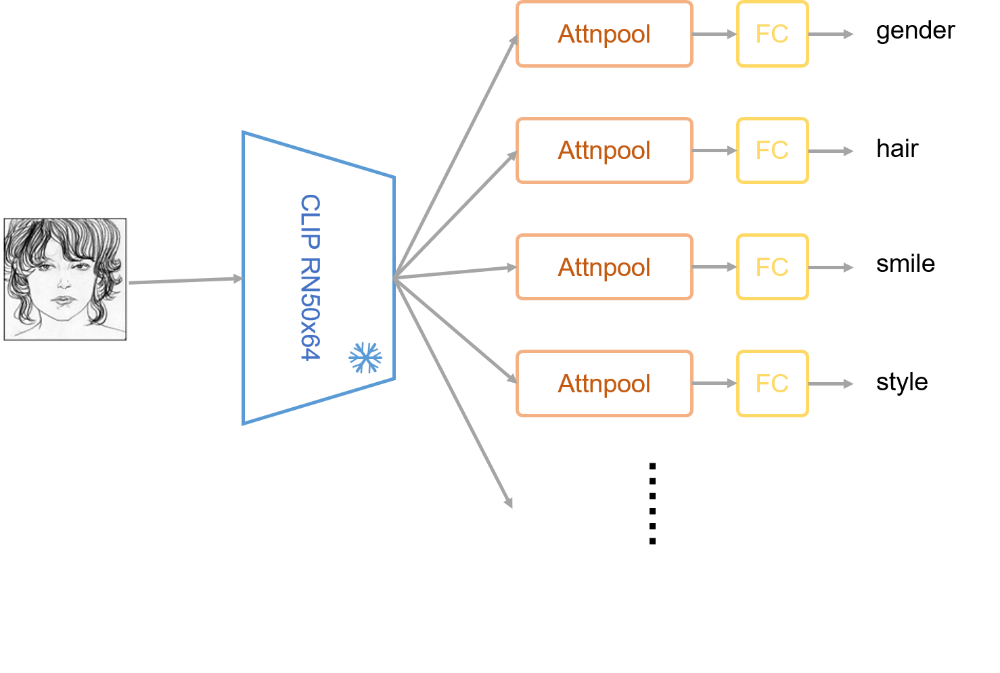

# The Project of Sketch2Attributes

## Intro

It's a course project. The aim of this project is to create a deep learning model that can predict the attributes of a sketch of humans (mainly based on [FS2K](https://github.com/DengPingFan/FS2K)). Basically speaking, it's a classification task (image in and attribute out). The model is based on [CLIP](https://github.com/openai/CLIP). Its architecture is shown below.

## Get Started
Following several steps to run the project:
1. Make sure you have installed Python(>=3.6) and PyTorch(>=1.10). It's highly recommended to use conda virtual environment, run `conda create -n sketch2attributes python=3.9` and `conda activate sketch2attributes`.
2. Clone the project from [GitHub](https://github.com/ParadoxZW/Sketch2Attributes)
3. Install CLIP following the [installation guide](https://github.com/openai/CLIP)
4. Run `git clone https://github.com/DengPingFan/FS2K.git` and follow their instructions to download and split the dataset.
5. Run `conda install --file requirements.txt` to install all the required packages.
6. Run `jupyter` to start the Jupyter Notebook, then click the `model.ipynb` file to run experiments.

All procedures including data loading, model defining, training, and evaluation are done in the Jupyter Notebook, with friendly comments.

## Appreciate

Great thanks to [FS2K](https://github.com/DengPingFan/FS2K) and [CLIP](https://github.com/openai/CLIP) for their valuable contributions.